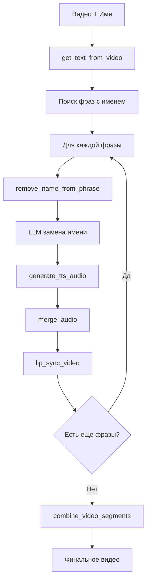

# Система Замены Имен в Видео Поздравлениях

Автоматическая система для замены имен в видео поздравлениях с помощью LLM и MCP tools.

## 🎯 Описание

Система принимает видеоролик и имя для замены, затем автоматически:

1. **Извлекает текст** из видео с временными метками
2. **Находит фразы** с целевым именем
3. **Заменяет имя** с использованием LLM для правильной падежной формы
4. **Генерирует новое аудио** с TTS
5. **Синхронизирует губы** с новым аудио
6. **Объединяет сегменты** в финальное видео

## 🛠️ Архитектура

### Компоненты:
- **LLM (GigaChat)** - для интеллектуальной замены имен с правильной падежной формой
- **MCP Server** - набор инструментов для обработки видео и аудио
- **VideoNameReplacer** - основной контроллер workflow

### MCP Tools:
- `get_text_from_video` - получение текста из видео с временными метками
- `remove_name_from_phrase` - удаление имени из фразы
- `generate_tts_audio` - генерация TTS аудио
- `merge_audio` - объединение оригинального и TTS аудио
- `lip_sync_video` - синхронизация губ с аудио
- `combine_video_segments` - объединение видео сегментов

## 🚀 Быстрый старт

### 1. Запуск MCP сервера
```bash
python run_server.py --http
```

### 2. Запуск демонстрации
```bash
python demo_workflow.py
```

### 3. Программное использование
```python
from LLM.gigachat_llm import VideoNameReplacer

# Создание экземпляра
replacer = VideoNameReplacer()

# Обработка видео
result = await replacer.process_video_replacement(
    video_file="video.mp4",
    target_name="Алексей",
    output_file="final_video.mp4"
)
```

## 📋 Workflow



## 🔧 Файловая структура

```
AI-DevTools-Hack/
├── LLM/
│   └── gigachat_llm.py          # Основной LLM контроллер
├── mcp/
│   ├── server.py               # MCP сервер
│   ├── mcp_instance.py         # Экземпляр FastMCP
│   ├── globals.py              # Глобальные настройки
│   └── tools/                  # MCP tools
│       ├── get_text_from_video.py
│       ├── remove_name_from_phrase.py
│       ├── generate_tts_audio.py
│       ├── merge_audio.py
│       ├── lip_sync_video.py
│       └── combine_video_segments.py
├── demo_workflow.py            # Демонстрационный скрипт
├── run_server.py              # Запуск сервера
└── README.md                  # Документация
```

## 📊 Пример использования

```python
import asyncio
from LLM.gigachat_llm import VideoNameReplacer

async def main():
    replacer = VideoNameReplacer()
    
    # Обработка видео
    result = await replacer.process_video_replacement(
        video_file="birthday_video.mp4",
        target_name="Мария",
        output_file="personalized_video.mp4"
    )
    
    print(f"Статус: {result['status']}")
    print(f"Файл: {result['output_file']}")
    
    await replacer.close()

# Запуск
asyncio.run(main())
```

## ⚙️ Конфигурация

### Переменные окружения:
- `HOST` - хост для MCP сервера (по умолчанию: 0.0.0.0)
- `PORT` - порт для MCP сервера (по умолчанию: 8000)
- `MCP_SERVER_NAME` - имя MCP сервера (по умолчанию: mcp-server)
- `WHISPER_MODEL` - модель Whisper (по умолчанию: tiny)
- `VIDEO_PATH` - путь к видео файлам

### LLM конфигурация:
- Модель: `ai-sage/GigaChat3-10B-A1.8B`
- API: `https://foundation-models.api.cloud.ru/v1`

## 🔍 Детали реализации

### Поиск имен
Система ищет целевое имя в транскрипции видео, используя регистронезависимый поиск.

### LLM обработка
GigaChat используется для интеллектуальной замены имен с учетом:
- Правильной падежной формы
- Контекста предложения
- Грамматических правил русского языка

### Временные метки
Каждый инструмент работает с точными временными метками для синхронизации аудио и видео.

## 🧪 Тестирование

Для тестирования используйте `demo_workflow.py`:
- Показывает все шаги workflow
- Демонстрирует работу каждого инструмента
- Выводит подробную информацию о процессе

## 🚨 Заметки

- Некоторые инструменты являются макетами и требуют реальной реализации
- Система спроектирована для легкого расширения функциональности
- Все ошибки обрабатываются и логируются

## 🔮 Возможности расширения

- Добавление поддержки других языков
- Улучшение качества TTS
- Реализация более сложных алгоритмов синхронизации губ
- Добавление эффектов и фильтров
- Поддержка пакетной обработки видео
