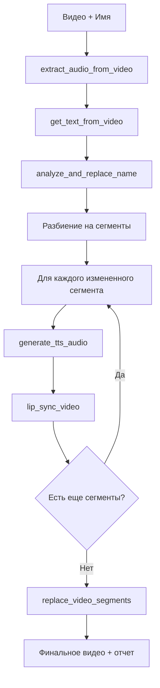

# AI-DevTools-Hack: Система Замены Имен в Видео Поздравлениях

[](https://python.org)
[](https://modelcontextprotocol.io)
[](https://giga.chat)

Автоматическая система для замены имен в видео поздравлениях с помощью LLM и MCP (Model Context Protocol) tools.

**Версия**: 1.0.0
**Автор**: AI-DevTools-Hack Team
**Лицензия**: MIT

## 🎯 Описание

Система принимает видеоролик и имя для замены, затем автоматически:

1. **Извлекает текст** из видео с временными метками
2. **Находит фразы** с целевым именем
3. **Заменяет имя** с использованием LLM для правильной падежной формы
4. **Генерирует новое аудио** с TTS (Text-to-Speech)
5. **Синхронизирует аудио** с видео сегментами
6. **Объединяет сегменты** в финальное персонализированное видео

## 🛠️ Архитектура

### Основные компоненты:
- **LLM (GigaChat)** - для интеллектуальной замены имен с правильной грамматикой
- **MCP Server** - сервер с набором инструментов для обработки мультимедиа
- **VideoNameReplacer** - основной контроллер автоматизированного workflow
- **Frontend** - веб-интерфейс для взаимодействия с системой

### MCP Tools (инструменты):
- `get_text_from_video` - извлечение текста из видео с временными метками
- `analyze_and_replace_name` - анализ и замена имени через LLM
- `generate_tts_audio` - генерация TTS аудио с клонированием голоса
- `extract_audio_from_video` - извлечение аудио из видео
- `lip_sync_video` - синхронизация аудио с видео сегментами
- `replace_video_segments` - замена сегментов в видео
- `enhance_audio_for_transcription` - улучшение аудио для транскрибации
- И другие вспомогательные инструменты

## 🚀 Быстрый старт

### Предварительные требования
- Python 3.10+
- FFmpeg (для обработки видео/аудио)
- Аккаунт GigaChat API (для LLM функций)

### 1. Установка зависимостей
```bash
# Установка Python зависимостей
uv sync

# Или через pip
pip install -r requirements.txt
```

### 2. Настройка переменных окружения
```bash
# Копируем пример файла
cp .env.example .env

# Редактируем .env файл с вашими API ключами
# GIGACHAT_API_KEY=your_api_key_here
```

### 3. Запуск MCP сервера
```bash
# Запуск с HTTP транспортом
uv run python run_server.py --http

# Или для stdio режима (для интеграции с другими инструментами)
uv run python run_server.py --stdio
```

### 4. Запуск веб-интерфейса
```bash
# Открываем frontend/index.html в браузере
# Или используем локальный сервер
python -m http.server 8001
# Затем открываем http://localhost:8001/frontend/
```

### 5. Программное использование
```python
import asyncio
from LLM.gigachat_llm import VideoNameReplacer

async def main():
    # Создание экземпляра
    replacer = VideoNameReplacer()

    try:
        # Обработка видео
        result = await replacer.process_video_replacement(
            video_file="videos/your_video.mp4",
            target_name="Алексей",
            output_file="videos/final_video.mp4"
        )

        print(f"Статус: {result['status']}")
        if result['status'] == 'success':
            print(f"Финальное видео: {result['output_video']}")
            print(f"Отчет: {result['report_file']}")

    finally:
        await replacer.close()

# Запуск
asyncio.run(main())
```

## 📋 Workflow



### Подробный процесс:

1. **Извлечение аудио** из оригинального видео
2. **Транскрибация** текста с временными метками
3. **LLM анализ** полного текста и интеллектуальная замена имени
4. **Разбиение** на сегменты с сохранением временных меток
5. **TTS генерация** для сегментов с изменениями
6. **Синхронизация аудио** с соответствующими видео сегментами
7. **Объединение** всех сегментов в финальное видео

## 📁 Файловая структура

```
AI-DevTools-Hack/
├── 📁 frontend/                    # Веб-интерфейс
│   └── index.html                 # HTML страница интерфейса
├── 📁 LLM/                        # LLM интеграции
│   ├── gigachat_llm.py            # Основной контроллер с GigaChat
│   ├── mcp_stdio_client.py        # MCP stdio клиент
│   ├── direct_llm.py              # Прямое использование LLM
│   └── simple_llm.py              # Упрощенная LLM интеграция
├── 📁 mcp_server/                # MCP сервер и инструменты
│   ├── server.py                  # Главный MCP сервер
│   ├── mcp_instance.py            # Экземпляр FastMCP
│   ├── globals.py                 # Глобальные настройки
│   ├── funcs/
│   │   └── video.py               # Вспомогательные функции видео
│   └── tools/                     # MCP инструменты
│       ├── analyze_and_replace_name.py    # Анализ и замена имени
│       ├── combine_video_segments.py      # Объединение сегментов
│       ├── cut_and_overlay_lips.py        # Обрезка и наложение губ
│       ├── enhance_audio_for_transcription.py # Улучшение аудио
│       ├── example_tool.py                # Пример инструмента
│       ├── extract_audio_from_video.py    # Извлечение аудио
│       ├── generate_tts_audio.py          # Генерация TTS
│       ├── get_text_from_video.py         # Получение текста из видео
│       ├── identify_segments_for_replacement.py # Идентификация сегментов
│       ├── lip_sync_video.py              # Синхронизация губ
│       ├── merge_audio.py                 # Слияние аудио
│       ├── remove_name_from_phrase.py     # Удаление имени из фразы
│       ├── replace_video_segments.py      # Замена сегментов видео
│       └── utils.py                       # Утилиты
├── 📁 TTS/                        # Text-to-Speech компоненты
│   └── tts_main.py                # Основной TTS модуль
├── 📁 videos/                     # Директория для видео файлов
│   ├── synced_segments/           # Синхронизированные сегменты
│   └── tts_segments/              # TTS аудио сегменты
├── 📁 tts_segments/               # Дополнительная директория TTS
├── 📄 .env.example                # Пример переменных окружения
├── 📄 pyproject.toml              # Конфигурация проекта (uv)
├── 📄 uv.lock                     # Lock файл зависимостей
├── 📄 run_server.py              # Скрипт запуска сервера
├── 📄 interactive_demo.py         # Интерактивная демонстрация
├── 📄 simple_demo.py              # Простая демонстрация
├── 📄 demo_workflow.py            # Демо workflow
├── 📄 video_selector.py           # Выбор видео файлов
├── 📄 test_*.py                   # Различные тестовые скрипты
└── 📄 README.md                   # Эта документация
```

## 📊 Пример использования

```python
import asyncio
from LLM.gigachat_llm import VideoNameReplacer

async def main():
    replacer = VideoNameReplacer()
    
    # Обработка видео
    result = await replacer.process_video_replacement(
        video_file="birthday_video.mp4",
        target_name="Мария",
        output_file="personalized_video.mp4"
    )
    
    print(f"Статус: {result['status']}")
    print(f"Файл: {result['output_file']}")
    
    await replacer.close()

# Запуск
asyncio.run(main())
```

## ⚙️ Конфигурация

### Переменные окружения (.env):
```bash
# GigaChat API настройки
GIGACHAT_API_KEY=your_api_key_here

# MCP сервер настройки
HOST=0.0.0.0
PORT=8000
MCP_SERVER_NAME=mcp-server

# Пути к файлам
VIDEO_PATH=videos/
WHISPER_MODEL=tiny

# Транспорт MCP
MCP_TRANSPORT=stdio  # или http
```

### Зависимости (pyproject.toml):
- **fastmcp** - MCP сервер
- **openai** - GigaChat API клиент
- **whisper** - транскрибация аудио
- **librosa** - обработка аудио
- **pydantic** - валидация данных
- **httpx** - HTTP запросы
- **python-dotenv** - переменные окружения

### LLM конфигурация:
- **Модель**: `ai-sage/GigaChat3-10B-A1.8B`
- **API endpoint**: `https://foundation-models.api.cloud.ru/v1`
- **Особенности**: поддержка русского языка, падежные формы, контекстная замена

## 🔍 Детали реализации

### Поиск и замена имен
- **Транскрибация**: Whisper для извлечения текста с временными метками
- **LLM анализ**: GigaChat для интеллектуальной замены с учетом грамматики
- **Сегментация**: Сохранение оригинальных временных меток для точной синхронизации

### TTS и аудио обработка
- **Множественные TTS движки**: gTTS, pyttsx3, XTTS v2 (с voice cloning)
- **Клонирование голоса**: использование оригинального аудио для аутентичности
- **Скорость и длительность**: автоматическая корректировка под оригинальные тайминги

### Видео обработка
- **Сегментация**: Точное вырезание сегментов по временным меткам
- **Синхронизация**: Замена аудио в видео сегментах
- **Конкатенация**: Объединение всех сегментов в финальное видео

### Текущий статус реализации ✅
- ✅ MCP сервер с полным набором инструментов
- ✅ LLM интеграция с GigaChat
- ✅ TTS генерация с voice cloning
- ✅ Видео сегментация и замена
- ✅ Полный автоматизированный pipeline
- ✅ Веб-интерфейс (базовый)
- ✅ Обработка ошибок и логирование

## 🧪 Тестирование

### Доступные демо скрипты:
- `interactive_demo.py` - интерактивный выбор видео и имени
- `simple_demo.py` - простая демонстрация основных функций
- `demo_workflow.py` - подробный показ всех шагов workflow
- `test_*.py` - различные тестовые скрипты для отдельных компонентов

### Тестовые данные:
- Поместите видео файлы в директорию `videos/`
- Примеры имен для замены: `name_anna.txt`, `name_dmitry.txt`, `name_maria.txt`

## 🔧 Устранение неполадок

### Распространенные проблемы:

**MCP сервер не запускается:**
```bash
# Проверьте зависимости
uv sync

# Проверьте переменные окружения
cat .env
```

**Ошибка с GigaChat API:**
- Проверьте API ключ в `.env`
- Убедитесь в доступности интернета
- Проверьте лимиты API

**Проблемы с видео/аудио:**
- Установите FFmpeg: `brew install ffmpeg` (macOS) или `apt install ffmpeg` (Ubuntu)
- Проверьте кодеки: `ffmpeg -codecs`

**Файлы не находятся:**
- Все видео файлы должны быть в `videos/` директории
- Относительные пути используются относительно корня проекта

## 🚨 Важные заметки

- **FFmpeg обязателен** для обработки видео и аудио
- **GigaChat API ключ** требуется для работы LLM функций
- Система создает временные файлы в `videos/` директории
- Все инструменты работают асинхронно для лучшей производительности

## 🔮 Возможности расширения

- **Многоязычная поддержка** - добавление других языков для TTS и LLM
- **Улучшенная синхронизация губ** - интеграция Wav2Lip или аналогичных инструментов
- **Пакетная обработка** - одновременная обработка нескольких видео
- **Веб-интерфейс** - улучшение frontend с drag-and-drop загрузкой
- **Качество TTS** - интеграция более продвинутых TTS моделей
- **Эффекты и фильтры** - постобработка видео с визуальными эффектами
- **API документация** - автоматическая генерация OpenAPI спецификаций

## 📚 API Документация

При запуске MCP сервера с `--http` флагом, документация доступна по адресу:
- **Swagger UI**: `http://localhost:8000/docs`
- **ReDoc**: `http://localhost:8000/redoc`
- **OpenAPI JSON**: `http://localhost:8000/openapi.json`

## 🤝 Вклад в проект

1. Fork репозиторий
2. Создайте feature branch (`git checkout -b feature/AmazingFeature`)
3. Commit изменений (`git commit -m 'Add some AmazingFeature'`)
4. Push в branch (`git push origin feature/AmazingFeature`)
5. Откройте Pull Request

### Требования к коду:
- Python 3.10+ совместимость
- Асинхронные функции где возможно
- Обработка ошибок и логирование
- Документирование функций
- Тесты для новых функций

---

**Примечание**: Это проект для демонстрации возможностей AI в обработке мультимедиа. Для продакшн использования рекомендуется дополнительное тестирование и оптимизация производительности.
